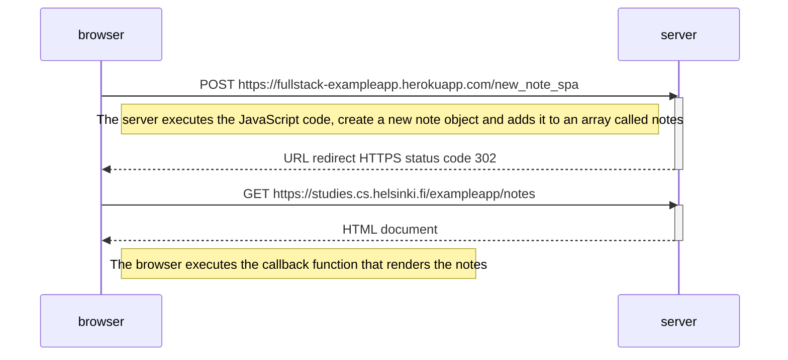

```mermaid
sequenceDiagram

    participant browser
    participant server
    
    browser->>server: POST https://fullstack-exampleapp.herokuapp.com/new_note_spa
    activate server
    
    Note left of server: The server executes the JavaScript code, create a new note object and adds it to an array called notes
    
    server-->>browser: URL redirect HTTPS status code 302
    deactivate server
    
    browser->>server: GET https://studies.cs.helsinki.fi/exampleapp/notes
    activate server
    server-->>browser: HTML document
    deactivate server
    
    Note right of browser: The browser executes the callback function that renders the notes 

```
