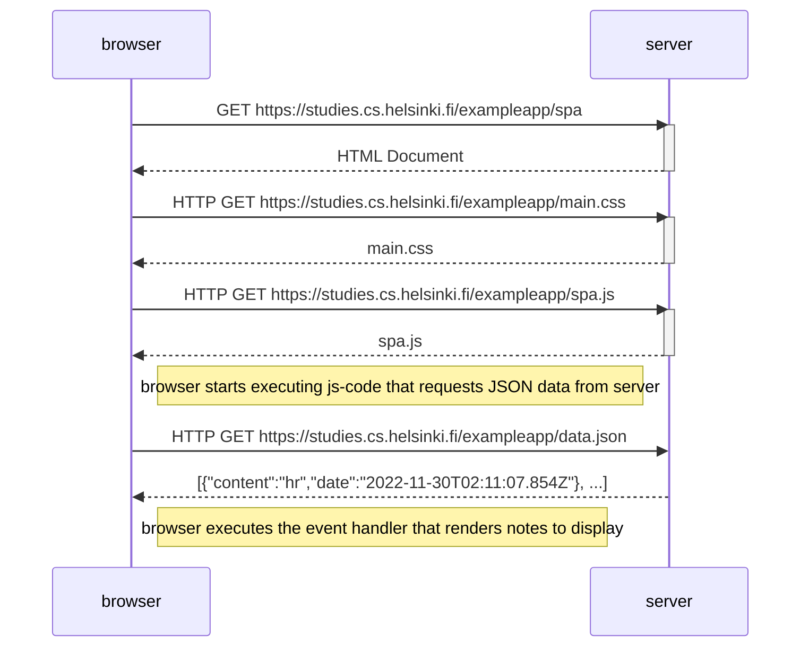

```mermaid
sequenceDiagram

    participant browser
    participant server
    
    browser->>server: GET https://studies.cs.helsinki.fi/exampleapp/spa
    activate server
    
    server-->>browser: HTML Document
    deactivate server
    
    browser->>server: HTTP GET https://studies.cs.helsinki.fi/exampleapp/main.css
    activate server
    server-->>browser: main.css
    deactivate server
    
    browser->>server: HTTP GET https://studies.cs.helsinki.fi/exampleapp/spa.js
    activate server
    server-->>browser: spa.js
    deactivate server
    
    note right of browser : browser starts executing js-code that requests JSON data from server

    browser->>server: HTTP GET https://studies.cs.helsinki.fi/exampleapp/data.json
    server-->>browser: [{"content":"hr","date":"2022-11-30T02:11:07.854Z"}, ...]
    
    note right of browser : browser executes the event handler that renders notes to display


```
