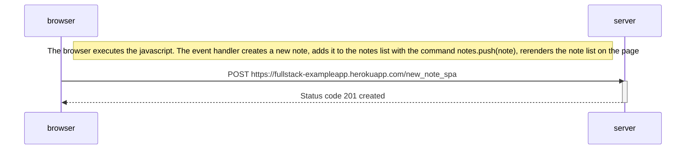

```mermaid
sequenceDiagram

    participant browser
    participant server
    
    Note right of browser: The browser executes the javascript. The event handler creates a new note, adds it to the notes list with the command notes.push(note), rerenders the note list on the page
    
    browser->>server: POST https://fullstack-exampleapp.herokuapp.com/new_note_spa
    activate server
    
    server-->>browser: Status code 201 created
    deactivate server

```
