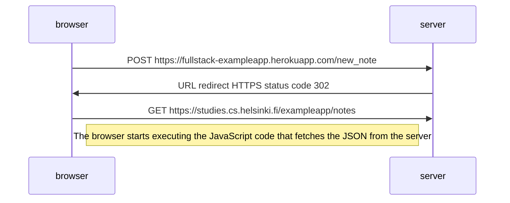

```mermaid
sequenceDiagram
    participant browser
    participant server
    
    browser->>server: POST https://fullstack-exampleapp.herokuapp.com/new_note
    server->>browser: URL redirect HTTPS status code 302
    browser->>server: GET https://studies.cs.helsinki.fi/exampleapp/notes
    
    Note right of browser: The browser starts executing the JavaScript code that fetches the JSON from the server

```
